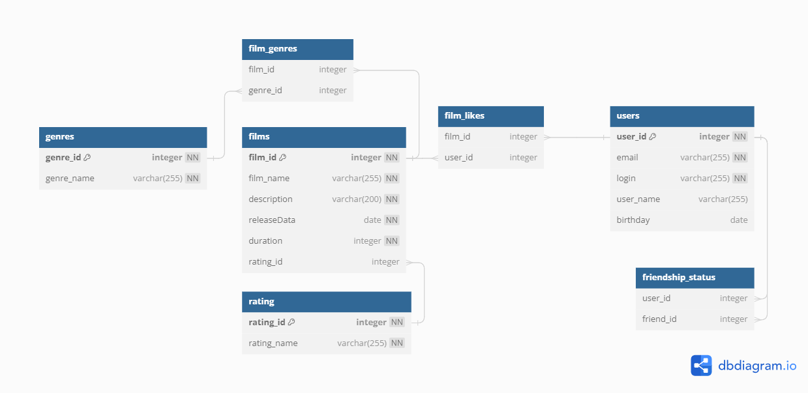

**Приложение Filmorate**\
**ER-диаграмма проекта Filmorate**
  

Диаграмма описывает структуру хранения данных приложения. Основные сущности приложения:
* Films - фильмы
* Users - пользователи

**Примеры запросов SQL**\
_Получение списка всех фильмов:_

<pre>SELECT *
FROM films; 
</pre>
_Получение информации о пользователе с ID = 1:_

<pre>SELECT *
FROM users
WHERE users.id = 1;
</pre>  
_Сортировка фильмов по жанрам:_
<pre>SELECT g.name,
       f.name      	
FROM films AS f
JOIN film_genre AS fg ON f.id  = fg.film_id
JOIN genre AS g ON fg.genre_id = g.genre_id 
order by g.name; 
</pre>

_Получение списка фильмов, которым поставил лайк пользователь в имени которого первая буква "Д":_
<pre>SELECT *
FROM (SELECT f."name" AS f_name, 
			 u."name" AS u_name 
	  FROM films f JOIN film_likes fl ON f.id = fl.film_id 
	               JOIN users u ON fl.user_id = u.id) AS fu 
WHERE substr("u_name", 1 , 1) = 'Д'; 
</pre>